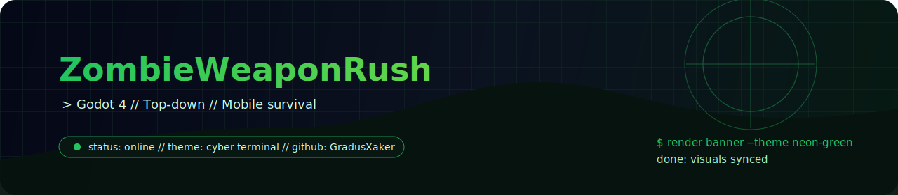

<div align="center">
  

  <h1>ZombieWeaponRush</h1>
  <p><strong>Неоновый top-down survival на Godot 4.</strong> Зомби, автострельба, апгрейды оружия и мобильный ритм боя.</p>

  <p>
    
    
    
    
  </p>
</div>

```text
> engine: godot 4
> gameplay: survive / auto-fire / upgrade weapons
> target: mobile first arcade action
```

## обзор

Это мобильный `2D`-шутер с видом сверху, где игрок автоматически стреляет по ближайшим врагам, собирает дропы и прокачивает оружие между волнами и матчами.

## Что реализовано

- Автоспавн зомби с постепенным ростом сложности.
- Автоогонь по ближайшему зомби.
- Дропы: оружейный ящик, хил, временный rapid fire.
- Дроп оружия: ящик выдает конкретный ствол из открытых по таблице весов.
- Прокачка по уровням (выбор 1 из 3 апгрейдов).
- Рост тира оружия при подборе оружейного дропа.
- Типы оружия: `Pistol`, `Shotgun`, `Rifle` с разными паттернами стрельбы.
- Оружейные дропы теперь выдают конкретный ствол (не случайный свитч) с весами выпадения.
- Типы зомби: обычный, быстрый бегун, толстый танк.
- Мета-прогрессия между матчами: постоянный `Scrap` и анлок оружия.
- Баланс вынесен в ресурсы `.tres` для правки без кода.
- Добавлены пулы `zombies/bullets/drops` для мобильной производительности.
- HUD с HP/XP/уровнем/тиром оружия, экран поражения и рестарт.
- Без строительства и без уровней зданий (по ТЗ).

## Управление

- Телефон: виртуальный стик на левой половине экрана.
- ПК (для отладки): `WASD`.
- Стрельба автоматическая.

## Структура

- `scenes/Game.tscn` — корневая сцена матча.
- `scripts/game.gd` — волны, спавн, дропы, интеграция систем.
- `scripts/player.gd` — движение, стрельба, XP и апгрейды.
- `scripts/zombie.gd` — ИИ и поведение типов зомби.
- `scripts/bullet.gd` — полет пули и попадание.
- `scripts/drop.gd` — дропы и подбор.
- `scripts/meta_progression.gd` — сохранение постоянного прогресса.
- `scripts/game_balance.gd` + `data/game_balance.tres` — общие параметры баланса.
- `scripts/weapon_stats.gd` + `data/weapons/*.tres` — конфиги оружия.
- `scripts/hud.gd` — UI и выбор апгрейда.

## Как запустить

1. Открыть проект в Godot 4.x.
2. Запустить сцену `res://scenes/Game.tscn` или проект целиком.

## Android APK

- Добавлен пресет экспорта: `export_presets.cfg` (`Android`, путь `build/ZombieWeaponRush.apk`).
- Для сборки нужен установленный Godot 4 + Android SDK/JDK/NDK и export templates.

## Что добавить следующим шагом

- Пулы объектов (зомби/пули/дропы) для лучшей мобильной производительности.
- Новые типы зомби (танк, бегун, плевок).
- Таблицы баланса в ресурсах (`.tres`) для удобной настройки без кода.
- Экран мета-прокачки между матчами.

## контакты

<p>
  <a href="https://github.com/GradusXaker"></a>
  <a href="https://vk.com/gradus_xaker"></a>
  <a href="mailto:gradus_xaker@mail.ru"></a>
</p>

